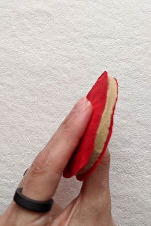

# Wood Pulp Filter for Covid - 19

This project is been developed by 
[Paloma Gonzalez](http://palomagr.mit.edu/index.html) and 
[José Tomás Domínguez](https://github.com/josetomas) in a collaboration of 
[Arauco ](https://www.arauco.cl)and [UTFSM Fablab](https://www.fablabs.io/labs/fablabutfsm).

COVID-19 has generated a global demand for face masks that our supply chains haven't been able to satisfy. Therefore, there is a huge need to create new materials and manufacturing methods to fabricate face masks and filters.  We are working on a wood pulp filter that protects from Covid - 19, and  could potentially be produced anywhere where there is a wood pulp factory. Wood pulp factories are present in most regions of the world.

Our goal is to physically modify wood pulp sheets to achieve the filtering performance of a N95 filter to produce a functional 
layer for respirators / masks / PPE for the corona viruses. 
[Wood pulp is the raw material for paper towels with the capacity of filtering particles of 0.3 μm.](https://smartairfilters.com/en/blog/paper-towel-effective-against-viruses-diy-mask/)
The corona virus measures approximately 0.1 μm. We can modify the compaction of the layers and/ or the size of the fibers to increase their filtering capacity / breathability. 

We are also developing a face mask which filters can be exchanged, 
completely out of wood pulp to be able to use our raw material.
[Our design is based on Wasp’s design](https://www.3dwasp.com/en/3d-printed-mask-from-3d-scanning/) but we are looking to work with injection molding 
and/or 2 mold processes instead of 3D printing. 
It is crucial to be able to mass produce the masks. 
The advantage of Wasp design is that the filters are held on the inside side of the mask. 
We think that this detail would help decrease the contamination of the filters when changing them. 
There are also fabric masks in which these filters could work [like this one, the HKMask](https://diymask.site/). 

## Key Parameters to measure [[2](https://scientificfilters.com/wp-content/uploads/2016/03/BasicFiltrationConcepts.pdf)]
- Scanning Electron Microscope [SEM](https://en.wikipedia.org/wiki/Scanning_electron_microscope): This tests characterize the materials porosity. Target: < 0.1 um. 
- Particle Retention Rate: "In a filtration process, the particle retention efficiency of a depth-type filter is expressed in terms of the particle size (in µm) at which a retention
level of 98% of the total number of particles initially challenging the filter is
obtained". Target: 95%
- Preassure Drop: The higher the pressure drop, the harder it is to breathe. Target: <5.82 [mmH20] at a flow rate of 32 [L/min]. 

All this tests could be replaced by a DOP ([DOP Guideline](http://www.eacoontario.com/pdf/2013/Revised%20August%2027%202013%20DOP%20PAO%20HEPA%20IntegrityTesting%20Procedure.pdf)). 

## Key Steps: 
- SEM Measurements, measure the porosity of the wood pulp sheets; it must be >0.1um
- Particle counting measurement, measure filtering capacity of the material, the ideal scenario will be an N95 filtering capacity. 
- In case the material's porosity is bigger than 0.1um or the filtering capacity isn’t enough,  Arauco is going to modify their manufacturing process to get a tighter material, or we are going to test a Electrospinning machine. 
- Make the material Hydrophobic. 
-Industrial production.

## Filter Development
Wood pulp sheets have the following disadvantages:
Hydrophilic, absorbs any liquid very fast so it could have a lower life expectancy and could absorb contaminated droplets, this can be controlled through design or modifying the material properties. 
Due to air flow, the user could inhale wood pulp fibers, we are adding wood pulp based fabrics to act as a filter. It’s relevant to point out that wood fibers aren’t toxic, you just can’t digest them. 
FDM 3D printed masks are slow to produce and have a porosity bigger than >0.1um, we are looking to develop the plastic parts of the mask through injection molding. 

## Current Development

We are working in a version made from wood pulp instead of 3D printing to be mass produced with compression molds similar to egg boxes.
The filter frame is still 3D printed. Our next step is to Incorporate it in the mold and make it with wood pulp.

### Raw Material

Celulose comes in letter size sheets, 21.59 cm. X 27.94 cm with a thikness of 1mm.

 

We are also working with wood pulp based fabrics, that will act as filter of big size wood pulp fibers than could be detached from the filter due to air flow: 

### Fabricating the filter

Due to the density of the cellulose sheets the material is not breathable. We succeeded in testing the feasibility of making it breathable. We pulverized it and compacted it into a breathable filter of 5mm thickness. The filter has three layers, the first and last of fabric to isolate fibers and possibly waterproof the pulp.
The filter needs to be tested to evaluate its filtering capacity and porosity.

 

### Assembling the mask

We are working with the face mask design by [Wasp](https://www.3dwasp.com/en/3d-printed-mask-from-3d-scanning/)

When everything is already manufactured

We assemble the parts: 

And get a finished face mask with a replaceable wood pulp based filter

## Molding

In order to advance into mass production of the mask, we have been developing a 3D printed wood pulp  mold, based on [Startasys](https://www.stratasysdirect.com/technologies/fused-deposition-modeling/fdm-tools-paper-pulp-molding). 

### Wood Pulp Molds

In the image above [3](https://onlinelibrary.wiley.com/doi/abs/10.1002/pts.2289) yo can see how Wood Pulp Molds work. 
The first part, called the moving half, of the mold is made from a solid material, and is the one that press the second part. 
The second part, called the fixed half, has two different layers, this allows the water to flow through the fiber network, into a porous material, to the drainage channels (as you can see in the image above); this allows the mold to release water and keep its final form. 

