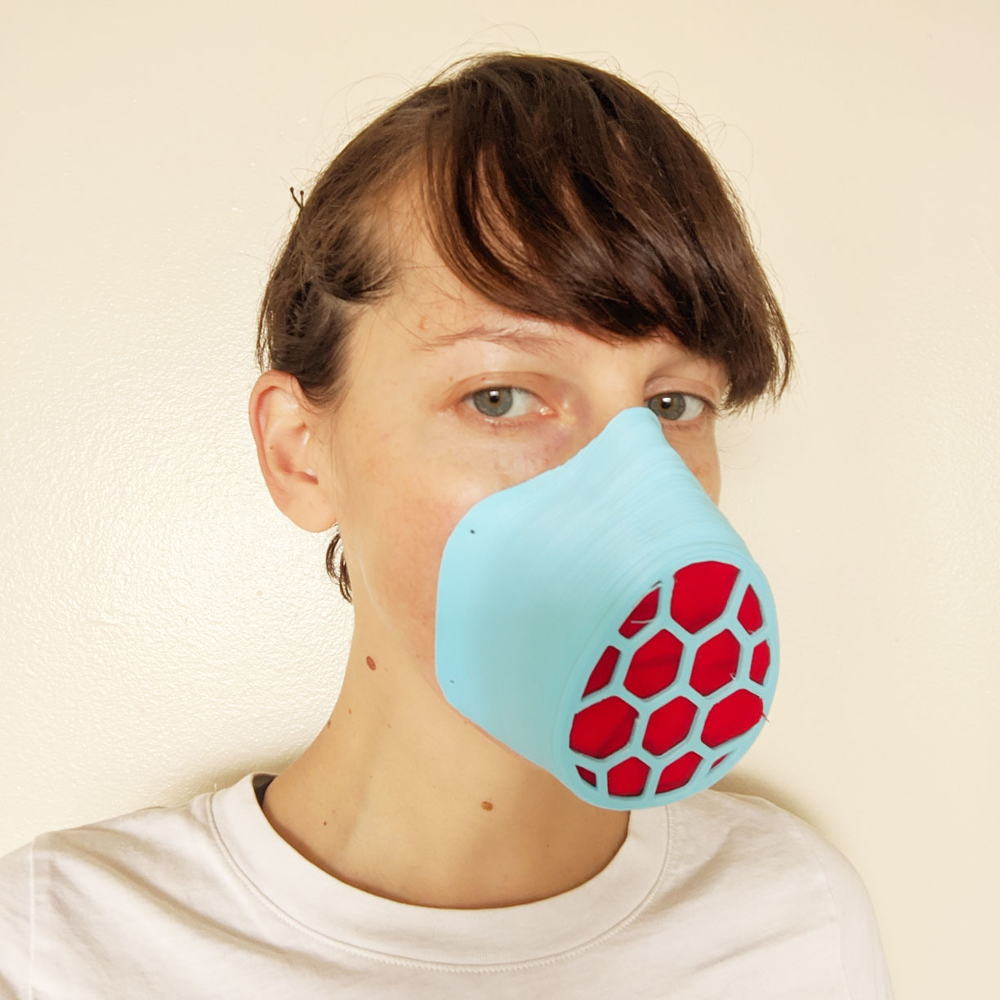
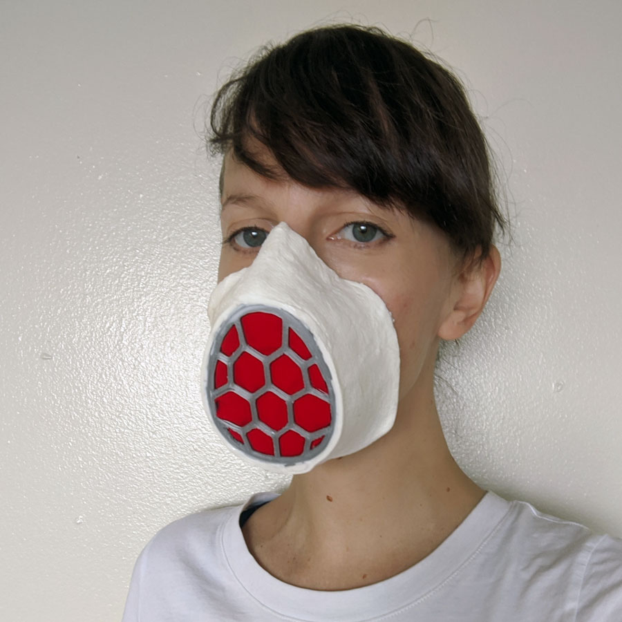
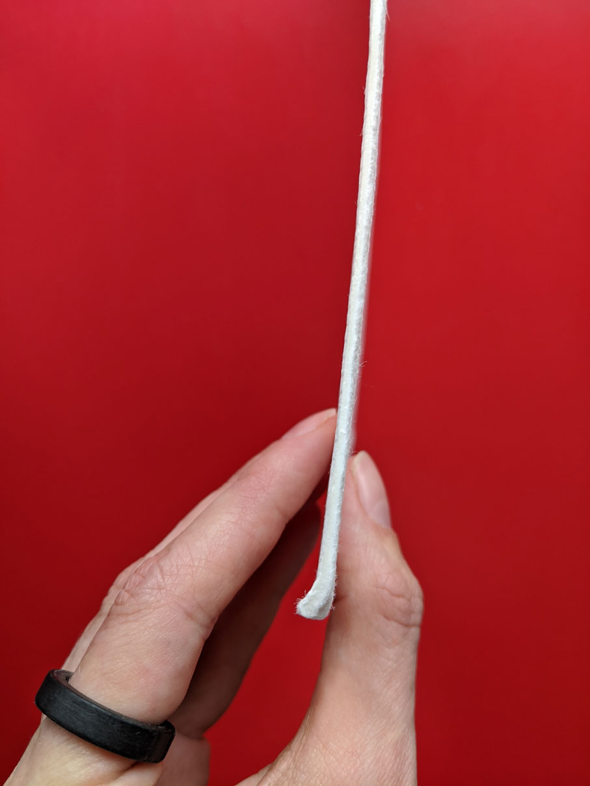
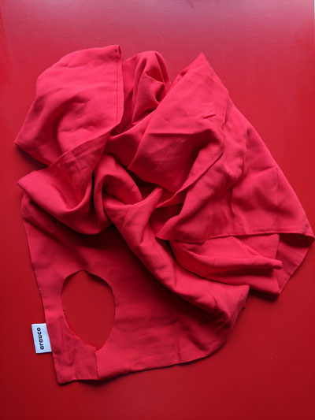
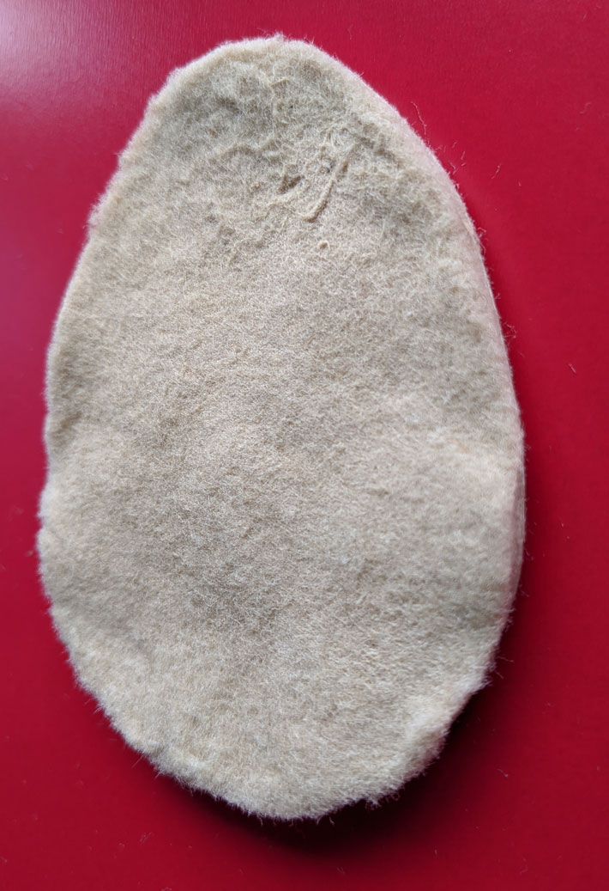
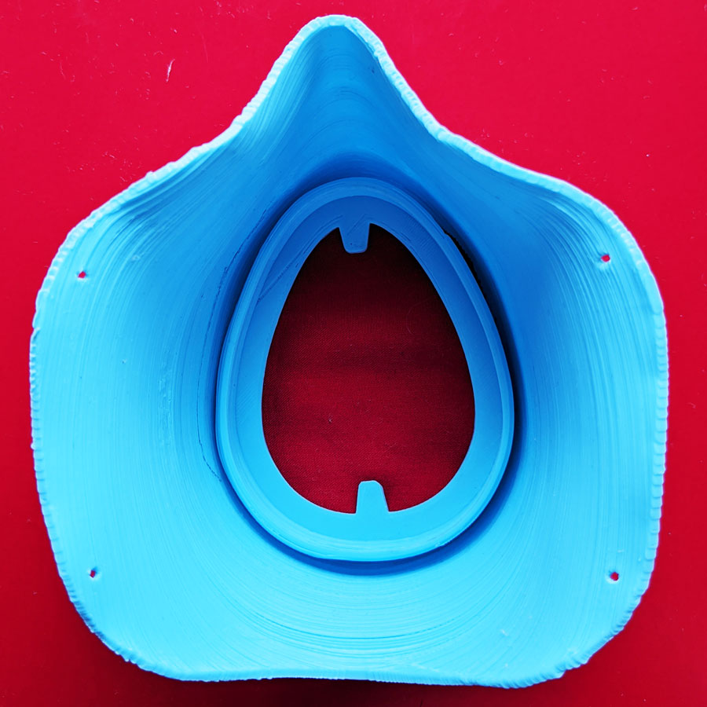
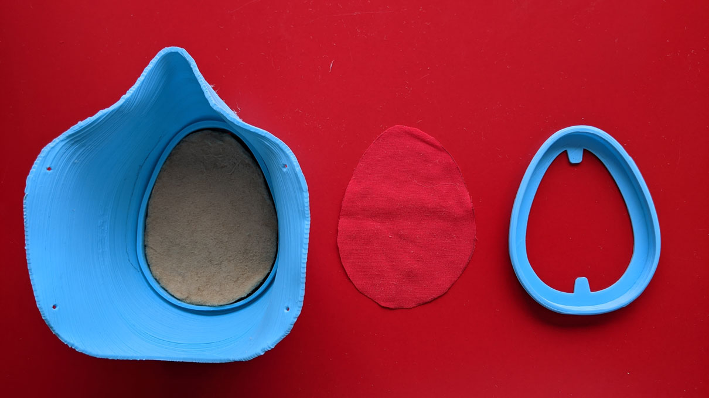
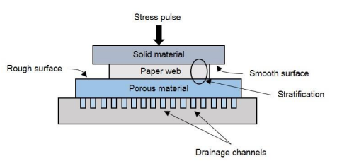
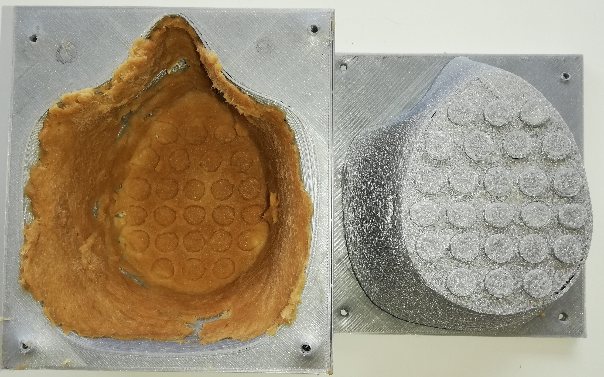

# Filtro de Celulosa para Covid - 19

Este proyecto esta siendo desarrollado por:
[Paloma Gonzalez](http://palomagr.mit.edu/index.html) and 
[José Tomás Domínguez](https://github.com/josetomas), en colaboracion con 
[Arauco ](https://www.arauco.cl)y [UTFSM Fablab](https://www.fablabs.io/labs/fablabutfsm).

COVID-19 ha generado una demanda global de máscaras faciales que nuestras cadenas de suministro no han podido satisfacer. Por lo tanto, 
existe una gran necesidad de crear nuevos materiales y métodos de fabricación para máscaras faciales y filtros en Chile y Latinoamérica. 
Estamos trabajando en un filtro de celulosa de madera que protege de Covid - 19, y podría producirse en cualquier lugar donde 
haya una fábrica de celulosa. Las fábricas de celulosa están presentes en la mayoría de las regiones del mundo. 

Nuestro objetivo es modificar físicamente las láminas de pulpa de madera para lograr el rendimiento de filtrado de un filtro N95 para producir
un filtro para respiradores / máscaras / PPE para los virus corona. 

[La celulosa es el material con que se fabrica el papel tissue que tiene una capacidad de filtración de partículas de 0.3 μm.](https://smartairfilters.com/en/blog/paper-towel-effective-against-viruses-diy-mask/)
Los virus corona son de aproximadamente 0.1 μm. Podemos modificar la compactación de las capas y 
/ o el tamaño de las fibras para aumentar su capacidad de filtración / respirabilidad.

------
También estamos desarrollando una máscara facial que puede intercambiar filtros,
completamente de celulosa madera para poder utilizar nuestra materia prima.
[Nuestro diseño está basado en el de Wasp.](https://www.3dwasp.com/en/3d-printed-mask-from-3d-scanning/) pero lo vamos a desarrollar en cartón moldeado
en vez de impresión 3D ya el costo es significativamente más bajo, y el proceso más rápido. Es fundamental el poder producir las máscaras industrialmente.

La ventaja del diseño Wasp es que el filtro se introduce en el interior de la máscara, lo que lo protege de agentes externos. Creemos que este
detalle va a contribuir a reducir la contaminación de los filtros. también existen máscaras de tela para las cuales podría servir el filtro
que estamos desarrollando, [como por ejemplo esta, la HKMask](https://diymask.site/).
 

## Parámetros Clave a Medir [[2](https://scientificfilters.com/wp-content/uploads/2016/03/BasicFiltrationConcepts.pdf)]
- Microscopio electrónico de barrido [SEM](https://en.wikipedia.org/wiki/Scanning_electron_microscope): Estas pruebas caracterizan la porosidad de los materiales. Objetivo: <0.1 um.
- Tasa de retención de partículas: "En un proceso de filtración, la eficiencia de retención de partículas de un filtro de tipo de profundidad se expresa en términos del tamaño de partícula (en µm) en el que se mantiene
El nivel del 98% del número total de partículas que desafían inicialmente el filtro es
obtenido ". Objetivo: 95%
- Caída de presión: cuanto mayor es la caída de presión, más difícil es respirar. Objetivo: <5.82 [mmH20] a una velocidad de flujo de 32 [L / min]. 

Todas estas pruebas podrían reemplazarse por un [DOP](http://www.eacoontario.com/pdf/2013/Revised%20August%2027%202013%20DOP%20PAO%20HEPA%20IntegrityTesting%20Procedure.pdf).

## Pasos Clave: 
- Mediciones SEM, miden la porosidad de las láminas de pulpa de madera; debe ser> 0.1um
- Medición de conteo de partículas, medir la capacidad de filtrado del material, el escenario ideal será una capacidad de filtrado N95.
- En caso de que la porosidad del material sea mayor a 0.1um o la capacidad de filtrado no sea suficiente, Arauco modificará su proceso de fabricación para obtener un material más ajustado, o vamos a probar una máquina de electrohilado.
- Hacer el material hidrofóbico.
-Producción industrial.

## Desarrollo de filtros
- Las láminas de celulosa de madera tienen las siguientes desventajas: Hidrofílico, absorbe cualquier líquido muy rápido,
por lo que podría tener una esperanza de vida más baja y podría absorber las gotas contaminadas, esto se puede controlar
mediante el diseño o la modificación de las propiedades del material. 
- Debido al flujo de aire, el usuario podría inhalar fibras de pulpa de madera, estamos agregando telas a base de pulpa de madera
para que actúen como filtro. 
- Es importante señalar que las fibras de madera no son tóxicas, simplemente no se pueden digerir. 

## Estado Actual

Estamos trabajando en una versión hecha de pulpa de madera en lugar de impresión 3D para producir en masa con moldeado de
cartón, similares a las bandejas de huevos. El marco del filtro todavía se imprime en 3D. Nuestro siguiente paso es
incorporarlo en el molde y hacerlo con pulpa de madera. **De acuerdo a nuestros calculos la media mascara va a costar 25-50$ pesos chilenos, 
y el filtro va a costar 80-90$ pesos chilenos.**

### Materias Primas

Las laminas de celulosa tienen 1x1.5m y 1mm de espesor.

También estamos trabajando con telas a base de pulpa de madera,
que actuarán como filtro de fibras de pulpa de madera de gran tamaño que podrían desprenderse del filtro debido al flujo de aire:

### Fabricación de filtros

Debido a la densidad de las láminas de celulosa, el material no es respirable.
Logramos probar la viabilidad de hacerlo transpirable. Lo pulverizamos
y lo compactamos en un filtro transpirable de 5 mm de espesor.
El filtro tiene tres capas, la primera y la última de tela para aislar las fibras y posiblemente impermeabilizar la celulosa.
El filtro necesita ser probado para evaluar su capacidad de filtrado y porosidad.

### Montar la Máscara

Estamos trabajando con el diseño de la máscara facial por [Wasp](https://www.3dwasp.com/en/3d-printed-mask-from-3d-scanning/)

Cuando todo ya está fabricado

Montamos las piezas:

Y obtenemos una máscara facial terminada, con un filtro intercambiable a base de pulpa de madera.

## Moldeado de la Celulosa
Para avanzar en la producción en masa de la máscara, hemos desarrollado un
molde de pulpa de madera impreso en 3D, basado en los moldes de [Startasys](https://www.stratasysdirect.com/technologies/fused-deposition-modeling/fdm-tools-paper-pulp-molding). 

**El objetivo es generar un proceso de diseño similar a la producción de moldes para cartón moldeado, pero con las técnicas de fabricación digital. 
Nuestra meta es poder agilizar la fabricación del molde y así comenzar la producción masiva de nuestra mascara.**

### Esquema de Moldes para Celulosa

En la imagen [[3](https://onlinelibrary.wiley.com/doi/abs/10.1002/pts.2289)] se puede observar como funcionan los moldes para pulpa de madera / papel. 
La primera parte, llamada la mitad móvil, del molde está hecha de un material sólido, y es la que presiona la segunda parte.
La segunda parte, llamada la mitad fija, tiene dos capas diferentes, esto permite que el agua fluya a través de la red de fibra, hacia un material poroso,
hacia los canales de drenaje (como puede ver en la imagen de arriba). Esto permite que el molde libere agua y mantenga su forma final.
### Primera Iteración

#### Molde
Los archivos del molde se pueden encontrar aqui [link](https://github.com/FabLabUTFSM/WoodPulp-Filter---COVID-19/tree/master/3D_Models). 

(Models M_1 correspond to the iteration)

#### Formula para el Material

Usamos la siguiente formula para la primera prueba de material:

- Celulosa pulverizada sin blanquear 11.3 gramos. 

Tiene que tener la siguiente textura:

- Agua: 269 gramos
- Acetato de polivinilo: 66.3 gramos. 

#### Resultados

En las siguientes imágenes se puede ver el primer resultado.
Vale la pena destacar que el material permite una resolución aceptable de la geometría del molde.

 

#### Conclusions

- Después de 12 horas de secado, el material estaba húmedo. Mejoraremos la geometría e introduciremos la porosidad que expulsa el agua.
- La capa de material poroso de la mitad fija debe tener un espesor de 1 mm.
- Debemos agregar canales de drenaje a la mitad fija.
- El material está obteniendo una buena resolución.
- Los cilindros para los orificios de respiración deben extenderse.

